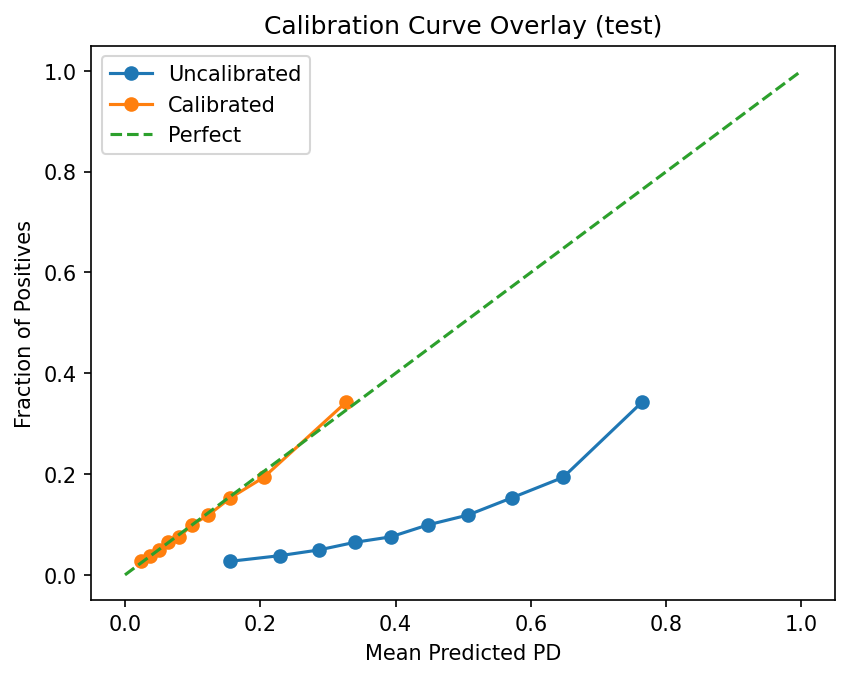
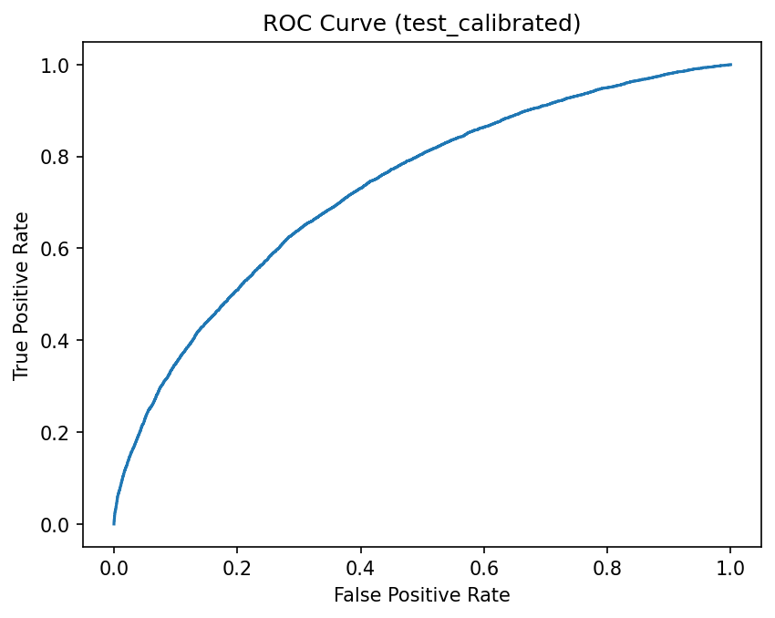
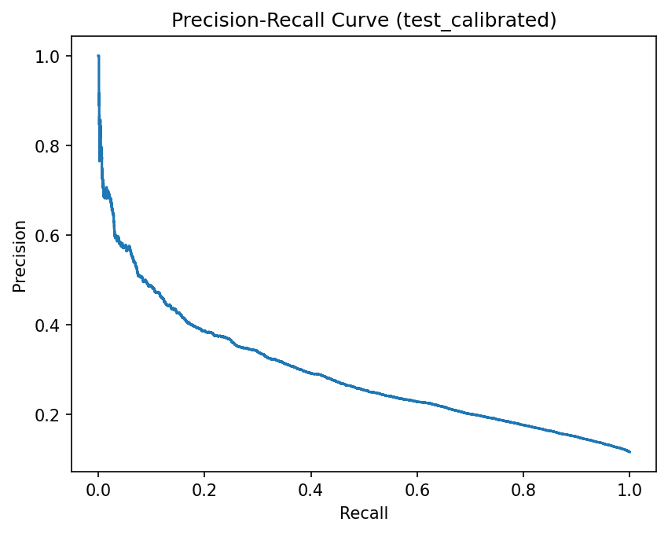

# Credit Risk PD Model — Calibrated Probability of Default + Underwriting Policy

Production-style credit risk project that predicts **Probability of Default (PD)**, calibrates probabilities, builds an underwriting threshold policy, and produces monitoring + governance artifacts.

## Highlights
- sklearn Pipeline (impute/scale/one-hot) + model selection (LogReg vs HistGradientBoosting)
- Probability calibration (sigmoid/isotonic) with before/after evaluation
- Risk bands (deciles) + lift table (default rate by band)
- Underwriting policy simulation (expected profit vs expected loss)
- Monitoring baseline (PSI drift) + Model Card / Monitoring Report

## Results (test set)
- ROC-AUC: **0.73**
- PR-AUC: **0.29**
- KS: **0.34**
- Brier score: **0.206 → 0.094** (after calibration)
- Risk bands: **34.3% worst decile vs 2.7% best decile (~12.8× lift)**

## Key Plots
**Calibration (before vs after)**  


**ROC (calibrated)**  


**PR (calibrated)**  


## Quickstart
Dataset not included; place CSV at data/loans_clean.csv
```bash
pip install -r requirements.txt
python pd_model.py --data_path data/loans_clean.csv --target_col Default
```

Recommended (if you have a date column for out-of-time testing):
```bash
python pd_model.py --data_path data/loans_clean.csv --target_col Default --date_col YOUR_DATE_COLUMN 
```

## Outputs

* reports/metrics_summary.json — metrics + policy outcomes

* reports/LEAKAGE_DROPS.json — leakage/sensitive feature drop audit

* reports/lift_table_test.csv — decile lift table

* reports/MODEL_CARD.md — model card

* reports/MONITORING_REPORT.md — monitoring plan + PSI drift

* models/pd_model_calibrated.joblib` — trained calibrated PD model 

## Scoring new applicants (PD output per row)
After training, you can load the saved model and output PD scores:

```python
import joblib
import pandas as pd

model = joblib.load("models/pd_model_calibrated.joblib")

df_new = pd.read_csv("data/new_applicants.csv")
pd_scores = model.predict_proba(df_new)[:, 1]  # PD for each applicant
df_new["PD"] = pd_scores
df_new.to_csv("reports/pd_scores_new_applicants.csv", index=False)
```

<details>
  <summary><b>How it works (technical)</b></summary>

- Leakage control: drops IDs + suspicious post-outcome fields; logs to `LEAKAGE_DROPS.json`
- Splits: base-train / calibration holdout / policy validation / test (test used once)
- Models: Logistic Regression baseline vs HistGradientBoosting; selection by PR-AUC
- Calibration: sigmoid/isotonic; improves probability accuracy (Brier + calibration curve)
- Decisioning: choose PD threshold maximizing expected profit (or profit under EL cap)
- Risk bands: PD deciles with monotonic default rates (lift table)
- Monitoring: PSI drift on predicted PD distribution + governance artifacts

</details>
